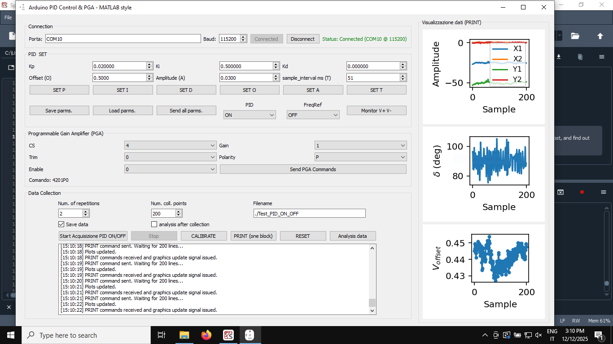
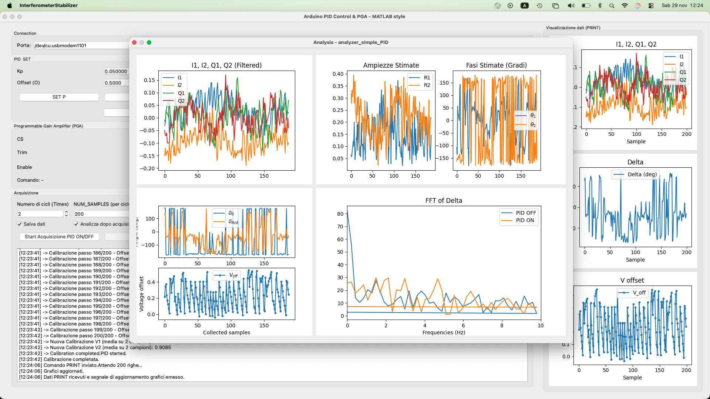

# Arduino_Interferometer_Stabilizer
An open hardware/source and low-cost interferometer stabilizer equipped with a digital lock-in amplifier.

The proposed firmware control a specific arduino Giga R1 shield designed to operate as function of the input signal coming from an interferometer where a piezo-electric mirror is direcly controlled by the Piezo DAC output (from the same board). The code is also embedded in different GUIs (Matlab and Python) or in Standalone applications made for Win and Mac Os.
 
All the data are also available at [Zenodo repository](https://doi.org/10.5281/zenodo.17761098) including also the standalone application (.dmg and .exe). These were located there for their large size.

Using one of the Matlab, Python or Standalone GUI you will obtaine a user friendly software like the one reported in the Figure below 

There you can set all the useful parameters, Activate or Deactive the PID, collect your data, save them, print and display in the embedded plotter or analyzed them as showin in the next figure

