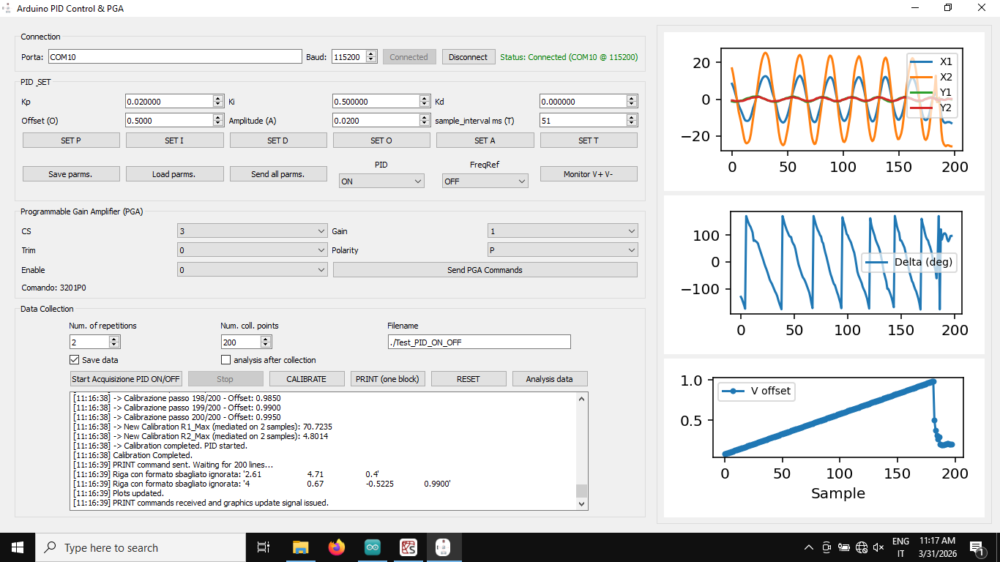
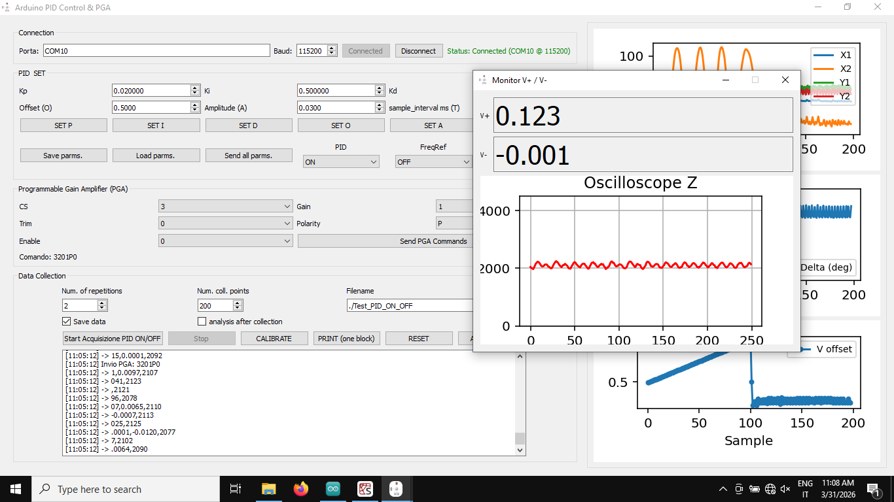
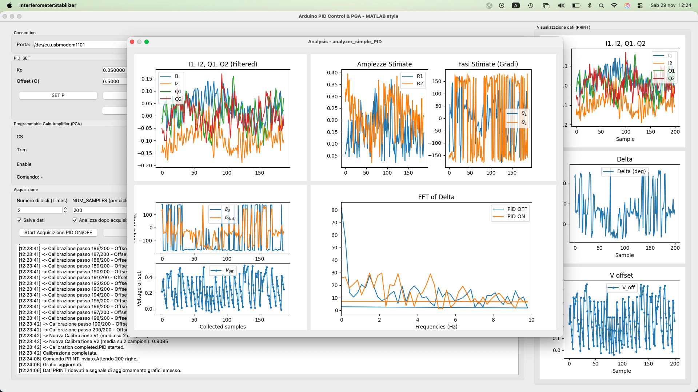

# Arduino Interferometer Stabilizer
An open hardware/source and low-cost interferometer stabilizer equipped with a digital lock-in amplifier. The Arduino board used for this device is Arduino GIGA R1 WiFi. 

The project is deposited in OSHWA with the code IT00026, and it can be seen at the following [link](https://certification.oshwa.org/it000026.html)

The proposed firmware control a specific arduino Giga R1 shield designed to operate as function of the input signal coming from an interferometer where a piezo-electric mirror is direcly controlled by the Piezo DAC output (from the same board). Moreover, the Python GUI code can also be compiled to be a Standalone applications made for Win and Mac Os. To do that, install PyInstaller and then in the Python IDE/ terminal exectute:

! pyinstaller --windowed --name InterferometerStabilizer --icon=icon.icns InterferometerStabilizer_GUI_Py.py

It will create a .exe application if you are using Windows or an .app file if compiled by using Mac Os. 
 
Using one of the Matlab, Python or Standalone GUI you will obtaine a user friendly software like the one reported in the Figure below. It shows the calibration proceedure with the related plots in terms of X1,X2,Y1 and Y2 on the top right plot, the delta on the central plot and the V offset in the bottom right one. 

Furthermore, in the following screenshot you can see the monitor V+/V- and the AC channel displayed by the GUI during a measurement

There you can set all the useful parameters, Activate or Deactive the PID, collect your data, save them, print and display in the embedded plotter or analyzed them as showin in the next figure

We updated the repository with a web application, it is runned directly here on Github and available at the following [link](https://giuseppeelio.github.io/Arduino_Interferometer_Stabilizer/). You can directly use it connecting your Arduino Interferometer Stabilizer and use it without any software or running python locally. Pay attention it works perfectly with Google Chrome, on Mac Os Safari doesn't work. 

About the electronic and the board manufacturing, the schematics, the Gerber file, the BoM and the Pick and Place files are avaialble in the relative directories.  

## A supporter is worth a thousand followers.

Dear reader, if you are interested in the development of Arduino Interferometer Stabilizer and its improvement with new features, please support our team by using the support button or by going directly to 
. We are actively working to do our best to achieve a reliable experimental apparatus. With your support we will move forward in developing new features, improve the web application experience and make it more essential for your experiments. You can support us directly buying coffees or with a membership. The support page is based on our previous other projects such as (https://github.com/GiuseppeELio/FRESCO-Board)(FRESCO-Board) an experimental apparatus to standardize Passive Radiative Cooling outdoor measurements. 

## Don’t forget to cite our published scientific article
Lio, Giuseppe Emanuele, et al. "Arduino based interferometer stabilizer equipped with a digital lock-in amplifier." arXiv preprint arXiv:2606.30199 (2026).

